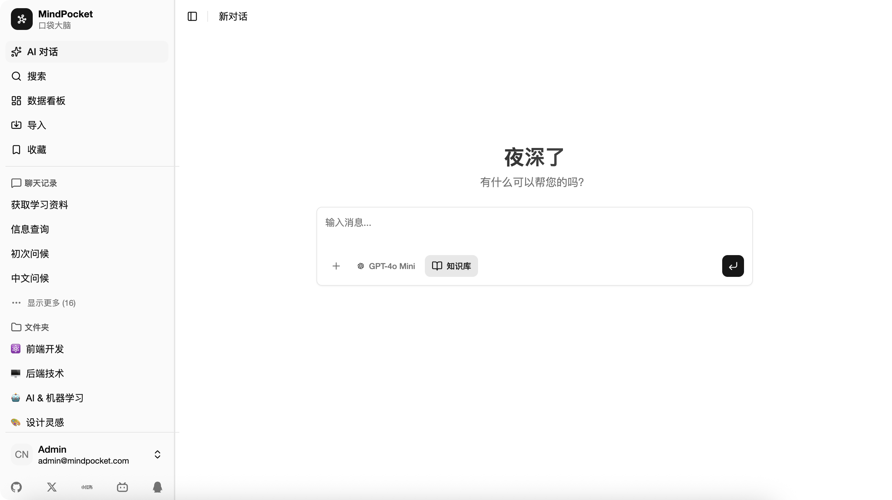
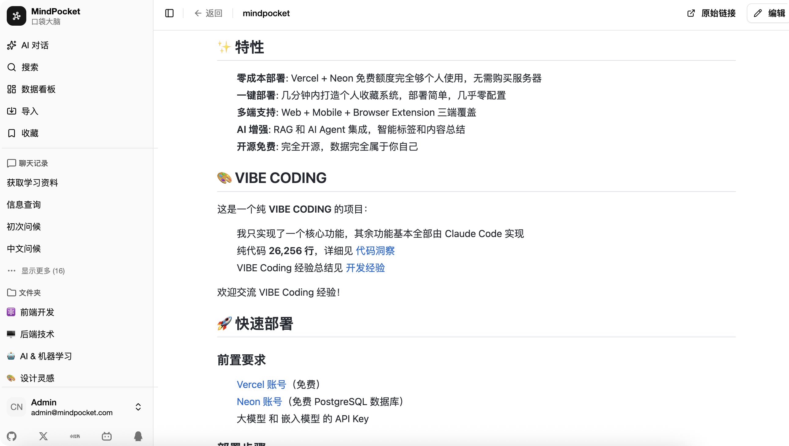
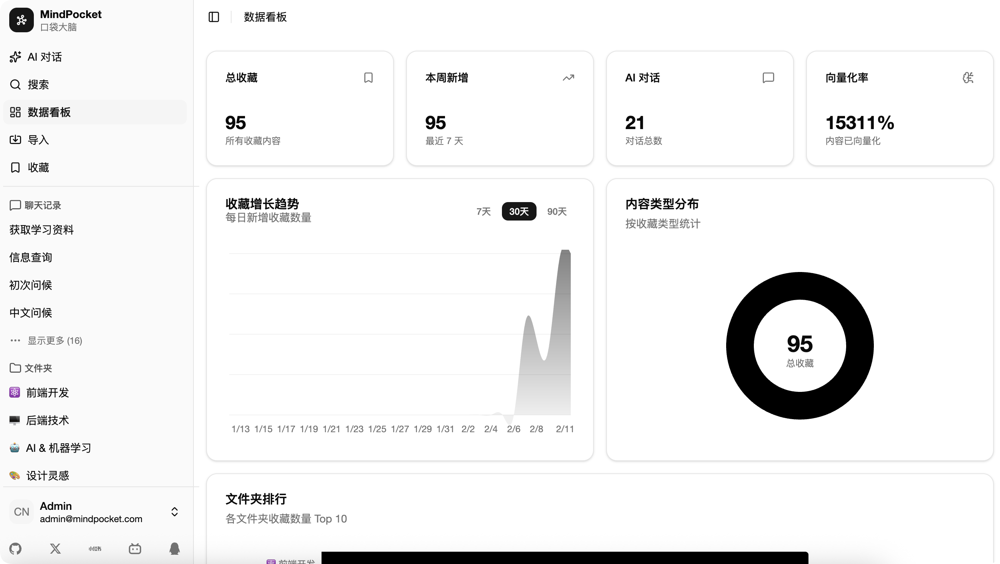
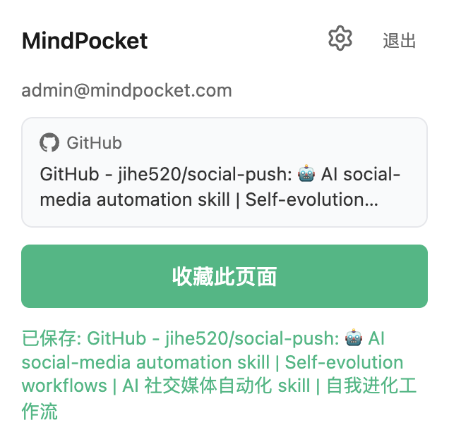

<p align="center">
  
</p>

<h1 align="center">MindPocket</h1>

<p align="center">
  A fully open-source, free, multi-platform, one-click deployable personal bookmark system with AI Agent integration.
</p>

<p align="center">
  <a href="./README_CN.md">中文文档</a>
</p>

<p align="center">
  
</p>

<details>
<summary>📸 More Screenshots</summary>

| Web | AI Chat | Mobile |
|:---:|:---:|:---:|
|  |  |  |
|  |  | |

</details>

MindPocket organizes your bookmarks with AI-powered RAG content summarization and automatic tag generation, making it easy to find and manage your saved content.

## ✨ Features

1. **Zero Cost**: Vercel + Neon free tier is enough for personal use
2. **One-Click Deploy**: Set up your personal bookmark system in minutes
3. **Multi-Platform**: Web + Mobile + Browser Extension
4. **AI Enhanced**: RAG and AI Agent for smart tagging and summarization
5. **Open Source**: Fully open source, your data belongs to you

## 🎨 VIBE CODING

This is a pure **VIBE CODING** project:

- I only implemented one core feature, the rest was built by Claude Code
- **26,256 lines** of pure code, see [Code Insight](./docs/codeinsight.md)
- VIBE Coding experience summary: [Development Experience](./docs/experience.md)
- VIBE Coding PRs are welcome!!!

## 🚀 Quick Deploy

### Prerequisites

- [Vercel Account](https://vercel.com) (Free)
- [Neon Account](https://neon.tech) (Free PostgreSQL)
- LLM and Embedding Model API Key

### Deploy Steps

1. **[Fork this repository](../../fork)**
2. **Connect to Vercel**
   - Click "New Project" → "Import Git Repository" in Vercel dashboard
   - Select your forked MindPocket repository
   - Click "Deploy"
   - In "Integrations" tab, add Neon integration and create a free database instance
   - Connect Vercel Blob storage
   - Add environment variables in "Settings" → "Environment Variables" (refer to `.env.example`)

3. **Initialize Database**
   - Database tables will be created automatically after deployment

4. **Create Admin Account**
   - Visit your deployment URL
   - Register your first account to start using

## 💻 Local Development

### Requirements

- Node.js 18+
- pnpm 10.9.0

### Installation

```bash
# Clone repository
git clone https://github.com/yourusername/mindpocket.git
cd mindpocket

# Install dependencies
pnpm install

# Configure environment
cd apps/web
cp .env.example .env.local
# Edit .env.local with your configuration

# Initialize database
pnpm db:push

# Start development server
cd ../..
pnpm dev
```

Visit http://127.0.0.1:3000 to start using.

### Commands

```bash
# Root
pnpm dev          # Start all apps
pnpm build        # Build all apps
pnpm format       # Format code
pnpm check        # Code check

# Web (apps/web)
pnpm dev          # Start Next.js
pnpm db:studio    # Database UI
pnpm db:generate  # Generate migrations
pnpm db:migrate   # Run migrations

# Native (apps/native)
pnpm dev          # Start Expo
pnpm android      # Run on Android
pnpm ios          # Run on iOS
```

## 🛠 Tech Stack

| Category | Technologies |
|----------|-------------|
| **Web** | Next.js 16, Radix UI, Tailwind CSS 4, Better Auth, Drizzle ORM, Vercel AI SDK, Zustand |
| **Mobile** | Expo, React Native, Expo Router |
| **Extension** | WXT, Vite |
| **Tooling** | Turborepo, pnpm, Biome, Ultracite |

## 📱 Supported Platforms

- ✅ Web Application
- ✅ iOS / Android Mobile App
- ✅ Browser Extension (Chrome / Firefox / Edge)

## 🚧 Roadmap

- [ ] More UI settings options
- [ ] Support more bookmark platforms
- [ ] Improve AI Agent experience
- [ ] Optimize RAG

See [todolist](./docs/todo.md) for detailed roadmap.

## 🤝 Contributing

Contributions are welcome! Feel free to submit issues, share VIBE Coding experiences, or open pull requests.

**QQ Group**: 682827415 | [Join](https://qm.qq.com/q/EOwlK8AiJM)

## 📄 License

MIT License - see [LICENSE](./LICENSE)

## 🙏 Acknowledgments

Thanks to Claude Code for its significant contribution to this project!
